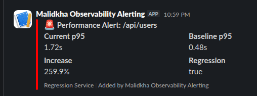
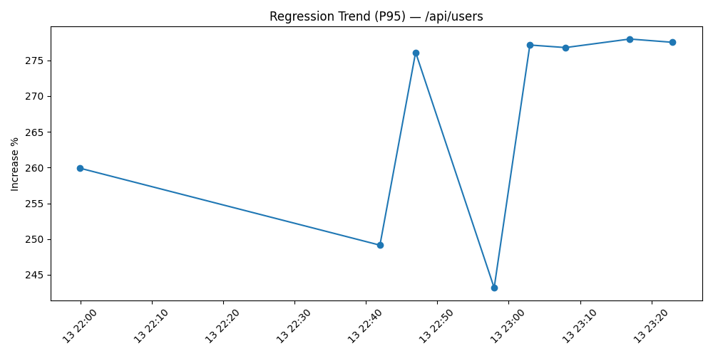

# Performance Observability & Automated Regression Detection Pipeline

A containerized end-to-end (almost :upside_down_face:) **performance observability and automated regression detection system** for PHP applications.

This project integrates:

- ⚡ Nginx + PHP-FPM application layer
- 📊 Prometheus metrics collection
- 📈 Grafana dashboards
- 🔥 SPX PHP profiler with flamegraphs
- 🚨 Alertmanager for alert routing
- 🤖 Custom Automated regression detection service (Node.js)
- 🧪 k6 load testing for automated performance validation
- 📄 PDF report generation for baselines & regressions (Python)

This project is intended as a practical demo of how to wire **PHP request metrics**, **alerting**,  **dynamic profiler activation**,  **automatic regression detection** and **historical trend analysis & tracking** together into a reproducible Docker-based performance observability & automated regression detection pipeline.

## Table Of Contents

   - **[Overview](#overview)**
   - **[Architecture](#architecture)**
   - **[Project Structure](#project-structure)**
   - **[Prerequisites](#prerequisites)**
   - **[Quick Start](#quick-start)**
   - **[Endpoints & Routes](#endpoints-routes)**
      - **[Service Endpoints](#service-endpoints)**
      - **[Application routes](#application-routes)**
      - **[Metrics and profiling](#metrics-and-profiling)**
      - **[API Endpoints](#api-endpoints)**
         - **[Regression Service (`:8090`)](#regression-service-8090)**
         - **[Report Service (`:5100`)](#report-service-5100)**
   - **[Environment Variables](#environment-variables)**
   - **[How Regression Detection Works](#how-regression-detection-works)**
      - **[Baseline storage](#baseline-storage)**
      - **[Alert handling](#alert-handling)**
      - **[Manual check](#manual-check)**
   - **[Full Workflow](#full-workflow)**
   - **[The Tracked Metrics](#the-tracked-metrics)**
   - **[Configuration Files](#configuration-files)**
   - **[Reports and Artifacts](#reports-and-artifacts)**
   - **[Troubleshooting](#troubleshooting)**
      - **[Common Issues](#common-issues)**
      - **[Logs](#logs)**
   - **[Notes](#notes)**
   - **[Contributing](#contributing)**
   - **[Additional Resources](#additional-resources)**
   - **[License](#license)**


## Overview

This project is designed to detect performance regressions automatically by:

1. collecting request latency metrics from PHP routes,
2. comparing current performance against stored baselines,
3. triggering SPX profiling when a route slows down,
4. sending Slack alerts if configured,
5. generating PDF regression reports,
6. surfacing flamegraphs and metrics for root cause analysis.
7. Automated generation of baseline and regression reports, historical trend analysis & tracking


## Architecture

The stack is designed to demonstrate a simple full pipeline:


```bash
[k6 Load Test]
      ↓
   Nginx
      ↓
 PHP-FPM Application
      ↓
Prometheus Metrics Exporter
      ↓
Prometheus Server
      ↓
Alertmanager
      ↓
Regression Detector (Node.js)
      ↓
Generate PDF Report & Historical Tracking (Python)
      ↓
SPX Trigger Service
      ↓
SPX PHP Profiler
      ↓
Flamegraph Storage
      ↓
Flamegraph UI
      ↓
Grafana Dashboards + Slack Alerts
```

- `nginx` reverse-proxies traffic to the PHP application
- PHP app exposes `/metrics`, `/flamegraphs`, and application routes
- Prometheus scrapes PHP, Nginx, and PHP-FPM exporter metrics
- Alertmanager sends webhook alerts to the regression service
- Regression service loads baselines from Redis and evaluates current metrics
- Regression service triggers SPX profiling via Redis and generates reports
- Report service writes baseline and regression PDF reports to disk
- `k6` generates synthetic traffic to validate baseline and regression behavior

## Project Structure

```bash
├── docker-compose.yml          # Main orchestration
├── alertmanager/               # Alert routing
├── k6/                         # Load testing scripts
├── nginx/                      # Web server config
├── php/                        # PHP-FPM setup
├── prometheus/                 # Metrics config
├── regression-service/         # Node.js regression detector
├── report-service/             # Python PDF generator
├── src/                        # PHP application
├── reports/                    # Generated PDFs
├── spx-data/                   # Flamegraph storage
└── testing/                    # Test utilities
```


## Prerequisites

- Docker
- Docker Compose

Optional:
- `K6` & `jq` (only if need to test locally with `/testing`)

## Quick Start

```bash
git clone https://github.com/khalid-el-masnaoui/Performance-Observability-Automated-Regression-Detection-Pipeline.git
cd regression-detection-nodejs
cp .env.example .env
```

Edit `.env` if you need custom host/URL values or add a Slack webhook.

Start the stack:

```bash
docker compose up -d --build
```

Verify services:

```bash
docker compose ps
```

## Endpoints & Routes

### Service Endpoints
| Service | URL | Notes |
|---|---|---|
| PHP App | http://localhost:8080 | Main web app routes and `/flamegraphs` |
| Prometheus | http://localhost:9090 | Scrapes app and exporter metrics |
| Alertmanager | http://localhost:9093 | Receives alerts from Prometheus |
| Grafana | http://localhost:3000 | Dashboarding (not provisioned by default) |
| Regression Service | http://localhost:8090 | Baseline, alert, manual checks |
| Report Service | http://localhost:5100 | PDF generation endpoints |
| SPX Web UI | http://localhost:8080/?SPX_KEY=dev&SPX_UI=1&SPX_UI_URI=/ | PHP-SPX Profiling Web UI


### Application routes

- `/` — home route
- `/api/users` — sample API route
- `/api/users?delay=<seconds>` — simulate slow requests

### Metrics and profiling

- `/metrics` — Prometheus metrics endpoint
- `/flamegraphs` — searchable SPX flamegraph list
- `/spx-data/` — raw SPX JSON profile output


### API Endpoints

#### Regression Service (`:8090`)

- `POST /baseline` - Store baseline metrics
- `POST /alert` - Handle Prometheus alerts
- `POST /check` - Manual regression check
- `GET /health` - Health check

#### Report Service (`:5100`)

- `POST /generate-baseline` - Generate baseline PDF report
- `POST /generate` - Generate regression PDF report
- `GET /health` - Health check


## Environment Variables

The default values are defined in `.env.example`:

```ini
REDIS_HOST=redis
NGINX_URL=http://nginx
PROM_URL=http://prometheus:9090
REPORT_URL=http://report-service:5000
REGRESSION_SERVICE_URL=http://regression-service:8090
SLACK_WEBHOOK=https://hooks.slack.com/services/XXXXX/XXXXX/XXXXX
```

## How Regression Detection Works

### Baseline storage

The regression service stores baseline metrics in Redis using keys like `baseline:/api/users`.

### Alert handling

`Alertmanager` sends alerts (based on `P95`) to the regression service at `/alert`

The regression service then:

- loads the baseline for the route,
- queries current metrics from Prometheus,
- calculates p95 increase,
- flags a regression when the increase is `> 30%`,
- triggers SPX profiling for the route,
- sends Slack notifications if configured,
- creates a PDF regression report.

### Manual check

You can also run a manual baseline check with:

```bash
curl -X POST http://localhost:8090/check

```

## Full Workflow

k6 simulates:

- baseline traffic to generate the baseline
- slow endpoint traffic (?delay=) to trigger a regression

**Note**: k6 traffic is automatically triggered the first time the application is up (using `k6/entrypoint.sh`). You can also generate traffic locally using `testing/makefile`

```bash
0-15s    → warmup phase with 20 requests
15s-20s  → generate baseline
20-50s   → metrics accumulate
50-80s  → p95 increases
~80s    → alert enters "pending"
~140s   → alert fires
         ↓
         regression detected → Redis(spx-enabled)
         ↓
         slack alert
         ↓
         regression report generated
         ↓         ↓
next request → SPX profiling ON
         ↓
flamegraph generated
```

## The Tracked Metrics

| Metric      | Why                 |
| ----------- | ------------------- |
| p95         | tail latency        |
| p99         | extreme latency     |
| avg         | overall performance |
| rps         | traffic load        |
| error_rate  | reliability         |
| max_latency | spikes              |
| throughput  | system capacity     |

**Note**: the regression is only checked against `P95`, you can extend it to include other metrics.

## Configuration Files

- `docker-compose.yml` — full stack definition
- `nginx/default.conf` — app routing, metrics, SPX, flamegraph endpoint
- `php/php.dockerfile` — PHP image with SPX and Redis extensions
- `prometheus/prometheus.yml` — Prometheus scrape config
- `prometheus/alerts.yml` — alert rule for slow endpoints
- `alertmanager/alertmanager.yml` — routes alerts to regression service
- `k6/baseline.js` — baseline traffic generator
- `k6/ingest_slow_requests.js` — regression/slow traffic scenario

## Reports and Artifacts

- `reports/baselines/` — baseline PDF reports (you find report examples in `example-reports`)
- `reports/regressions/` — regression PDF reports (you find report examples in `example-reports`)
- `spx-data/` — SPX profile JSON output

<p float="left" align="middle">
     
     
</p>


## Troubleshooting

### Common Issues

**Flamegraphs not generating**:
```bash
# Ensure permissions
chmod -R 777 spx-data
chmod 33:33 spx-data # 33 is the UID of www-data which php-fpm/nginx runs under
```

**SPX Profiling not triggering**:
- Check Redis connection
- Verify SPX configuration in `php/spx.ini`

Make sure keys are created in redis

```bash
docker exec -it prometheus-spx-redis-1 redis-cli KEYS "*"
```

**No alerts firing**:
- Verify Prometheus can reach Alertmanager
- Check alert rules syntax

**Regression not detected**:
- Ensure baseline is set
- Check Prometheus query alignment
- Verify sufficient traffic volume

**Baseline & Regression reports missing**:
- If regression reports are missing, confirm `report-service` is healthy at `http://localhost:5100/health`.


### Logs

View service logs:
```bash
docker compose logs -f [service-name]
```

## Notes

- Route normalization is implemented in `src/index.php` to replace numeric IDs and UUIDs with normalized route labels.
- Metrics are recorded using Prometheus histograms with route, method, and status labels.
- The sample PHP app is intentionally simple and can be replaced by any PHP codebase.

## Contributing

Contributions are welcome! Please feel free to submit a Pull Request.

## Additional Resources

- [Prometheus Documentation](https://prometheus.io/docs/)
- [Grafana Documentation](https://grafana.com/docs/)
- [k6 Documentation](https://k6.io/docs/)
- [SPX Profiler](https://github.com/NoiseByNorthwest/php-spx)

## License

This repository has no license defined; add one if you want to share or publish it.

---

This project provides a full (almost :upside_down_face:) production-grade performance engineering stack for PHP applications.</content>
<parameter name="filePath">https://github.com/khalid-el-masnaoui/Performance-Observability-Automated-Regression-Detection-Pipeline.git/README.md
